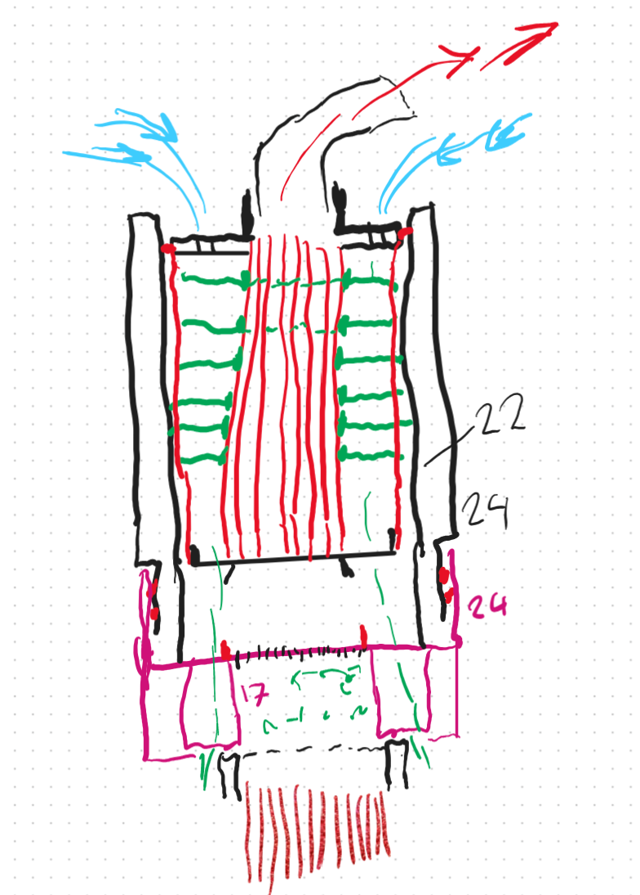

   # Full Technical Disclosure – Heat Exchanger and Vapor Cooling Design
   
   **Date of Disclosure:** 2025-04-18  
   **Inventor:** Ville Johannes Savolainen  
   **Disclosure Type:** Public Prior Art
   
   ---
   
   ## 1. Overview
   
   In portable vaporizers, a major challenge is managing two heat-related factors:
   - Ensuring the **vapor is cool enough** to be comfortably inhaled without irritating airways
   - Preventing the **device body** from overheating during or after use
   
   This invention addresses both problems. It introduces a heat exchange structure that leverages the **fresh incoming air** to cool the **hot outgoing vapor**, thereby **reclaiming thermal energy** and **increasing efficiency**. Depending on design goals, the system can prioritize **maximum thermal efficiency** or **enhanced cooling capacity**, even at the expense of some energy loss.
   
   ---
   
   ## 2. Principle of Operation
   
   The hot vapor exiting the heater (typically 150–200 °C) is passed through a section of the device where it interacts with **thermally conductive surfaces** such as:
   - Aluminum (raw, anodized, cast, or machined)
   - Copper
   - Stainless steel
   - Silver or gold-plated metals
   
   The core innovation is that these conductive structures are also exposed—on their opposite side—to the **fresh incoming air**, drawn in by the user's inhalation. This fresh air path **never directly mixes** with the vapor path but passes close enough to absorb the heat being conducted through the metal.
   
   ---
   
   ## 3. Heat Exchange Geometries
   
   Several structural implementations are proposed:
   
   - **Multiple small-diameter tubes** carrying vapor, thermally bonded to fins or plates exposed to the intake air
   - **Zig-zag or serpentine channels** that promote turbulent vapor flow and improve thermal transfer
   - **Stacked metal sheet compartments**, where alternating chambers carry vapor and fresh air
   - **Double-wall chambers**, where the vapor flows through an inner path surrounded by fresh air
   - **Spiral tunnels**, or routing vapor around the outer edge of the device to optimize thermal contact
   
   In all cases, the vapor and air remain **physically isolated** to preserve cleanliness and prevent contamination.
   
   ---
   
   ## 4. Efficiency and Material Considerations
   
   To maximize heat exchange efficiency:
   - Materials should have **high thermal conductivity**
   - Parts should have **low heat capacity** to prevent energy being stored rather than transferred
   - Designs should aim to be **lightweight**, especially for use cases involving **short puffs** rather than long sessions
   
   This allows the heat exchanger to begin working immediately during brief inhalations, without needing to “warm up” itself.
   
   This principle is borrowed from **building ventilation systems**, where exhaust air warms incoming air through conductive fin arrays—an idea now scaled down and adapted for compact vaporizers.
   
   ---
   
   ## 5. Modular and Mechanical Implementation
   
   Two main physical configurations are disclosed:
   
   1. **Clip-On Cooling Block / Panel**
      - A structure that attaches to the top panel of the vaporizer
      - Uses almost the full device width/length profile to house tubes, fins, and plates
      - Maintains a low device height while increasing surface area
   
   2. **Removable Top Section**
      - A modular top part that integrates the heat exchanger
      - May take the form of a metal tube or press-fit block
      - Enables user customization or upgradeability
   
   The vapor path may pass through multiple metal tubes arranged in rows or spirals. These tubes are **thermally connected** to the air-side structures to allow efficient energy transfer.
   
   ---
   
   ## 6. Energy Recycling and Performance Benefits
   
   Key advantages of this invention include:
   
   - **Near-unlimited cooling capacity**  
     Since heat is not stored but transferred in real time, performance doesn't degrade over time like in many traditional cooling units.
   
   - **Preheated intake air**  
     Reduces the energy required by the main heater to reach vaporization temperature. For example, preheating incoming air by 30 °C dramatically improves heating efficiency.
   
   - **Improved battery life**  
     Less heater load means longer run times and reduced energy waste.
   
   - **Lower surface temperature of the device**  
     Since heat is not radiated to the body, but transferred to the air path, the device remains cooler externally.
   
   ---
   ## 7. Visual Examples

### Figure 1 – Panel-Based Heat Exchanger

A compact vaporizer panel with built-in airflow isolation and flat heat exchange layers. Maximizes surface area with minimal added thickness.

---

### Figure 2 – Vertical Channel Heat Recovery Design

Depicts alternating vertical vapor and air flow paths surrounded by conductive material. Hot vapor channels transfer heat to fresh intake air passing through adjacent columns.

   
   ## 8. Summary & Intent
   
   This invention enables both vapor cooling and energy recycling in compact vaporizers. By transferring heat from the vapor to the fresh intake air—without mixing the two—a significant efficiency gain is achieved. The system improves comfort, reduces power consumption, and maintains cooler external temperatures through thoughtful geometry and material choices.
   
   This disclosure is published as **public prior art** to prevent any future attempt to patent similar vapor cooling or integrated heat exchanger mechanisms.
