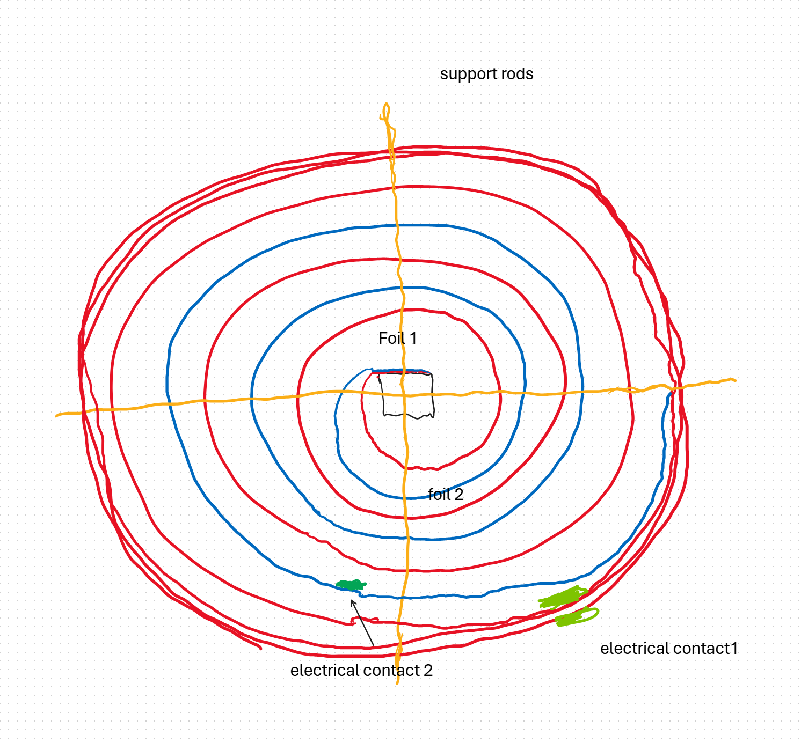

# Assembly Improvement: Extended Support Rods in Self-Wrapping Foil Spiral Heater

**Date of Disclosure:** 2025-04-23  
**Inventor:** Ville Johannes Savolainen  
**Disclosure Type:** Public Prior Art

---

## Context

In traditional spiral foil heater designs, support rods (e.g., ceramic pins) must fit precisely inside an outer structural tube (glass, ceramic, or metal). This often makes assembly difficult because the rods must be:
- Precisely cut to length
- Inserted with high accuracy
- Held in place delicately during spiral construction

This step was identified as one of the most **error-prone and time-consuming** phases of the assembly process.

---

## Invention: Extended Rods Enabled by Self-Wrapping Foil Tube

With the introduction of a self-wrapping stainless steel foil tube (where the foil spiral is extended and wrapped to form its own enclosure), it became possible to **extend the support rods through the full spiral and into the wrapping region** of the foil tube.

### Benefits:
- **Easier handling** during assembly due to longer rods
- **Improved alignment** between spiral layers and support rods
- **Reduced precision requirements** for rod cutting and placement
- **Enhanced mechanical strength**, since rods can be fully supported along their entire length

This allows for more **consistent production** and **less risk of assembly errors**, particularly in compact vaporizer designs.

---

## Summary

This improvement enhances the manufacturability of spiral foil heaters by using the structural freedom of the self-wrapping foil design to allow **longer support rods**. These rods extend beyond the spiral into the tube region, streamlining the assembly process and increasing robustness.

This document is published as **public prior art** to prevent any future attempt to patent this specific assembly-related improvement.

---

## Visual Reference

*Figure: Diagram illustrating support rods passing through spiral and into the self-wrapped foil tube region, enabling longer rod length and easier assembly.*
